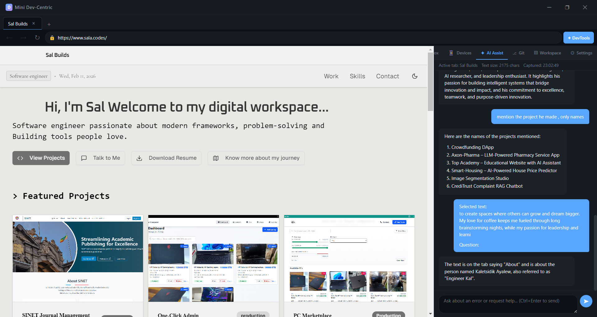

# Mini Dev-Centric Browser

A developer-focused desktop browser built with Electron, Vite, and React. It combines a modern browsing experience with integrated dev tools panels so you can debug, inspect, and test without leaving the app.



## Highlights

- Multi-panel dev tools workspace with focused panels (Console, Network, Device Sim, Git, API Tester, AI Assistant, Settings, and more).
- Electron + React UI for a fast desktop experience.
- Vite-powered renderer build for quick iteration.
- Configurable app settings via `app-config.json`.

## Tech Stack

- Electron (main process)
- React + Vite (renderer)
- Simple Git integration for project workflows

## Project Structure

- `main.js`: Electron main process entry.
- `preload.js`, `webview-preload.js`: Preload bridges for renderer access.
- `src/`: React renderer source.
  - `components/`: UI panels and layout.
  - `data/`: Sample data and tool definitions.
- `app-config.json`: App-level configuration.

## Setup

```bash
npm install
```

## Development

```bash
npm run dev
```

This starts Vite and launches Electron once the dev server is ready.

## Build

```bash
npm run build
```

Builds the renderer and packages the Electron app.

## Configuration

Update `app-config.json` to customize the app behavior. If you use environment variables, put them in `.env` (ignored by Git).

## Scripts

- `npm run dev`: Start Vite + Electron in dev mode.
- `npm run build`: Build and package the app.
- `npm run preview`: Preview the Vite build.

## Notes

- Build artifacts are ignored via `.gitignore` (e.g., `dist/`, `release/`, `node_modules/`).
- Windows builds may require Developer Mode to avoid symlink errors during packaging.

## License

